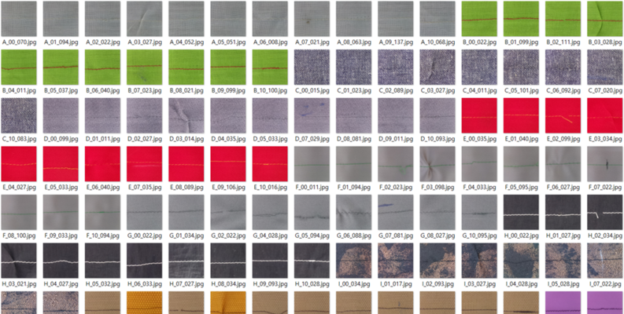

# StitchingNet 데이터셋을 활용한 Fine-Tuning 및 모델 경량화

## 프로젝트 개요

본 프로젝트는 공개된 **StitchingNet 데이터셋**을 사용하여 봉제 불량을 탐지하는 경량 CNN 모델들을 Fine-Tuning 하고, 이를 라즈베리파이와 같은 엣지 디바이스 환경에서 실시간 추론할 수 있도록 모델을 압축(양자화, 채널 조정, Pruning)하는 것을 목표로 합니다.

MobileNet 시리즈를 포함한 다양한 CNN 구조를 평가하고, 정확도를 유지하면서도 모델 크기와 연산량을 최소화하기 위해 PTQ/QAT 양자화, 알파(Width Multiplier) 조절 등의 기법을 적용하였습니다. 또한 Pruning 및 Knowledge Distillation 기법들을 추가적으로 적용해볼 예정입니다다.

## 데이터셋 정보

Kaggle에 공개된 [**StitchingNet 데이터셋**](https://www.kaggle.com/datasets/hyungjung/stitchingnet-dataset)을 사용합니다. 이 데이터셋은 11가지 클래스(정상 및 10가지 불량 유형)로 구분된 총 14,565장의 봉제 이미지(224×224 크기)를 포함하고 있으며, 다양한 원단과 실의 색상을 고려하여 만들어졌습니다.




학습을 위해 데이터셋을 훈련, 검증, 테스트 세트로 나누고 다양한 데이터 증강 기법을 적용하였습니다.


## 모델 경량화 기법

다음의 경량화 기법을 적용하여 라즈베리파이에서 실시간 추론이 가능한 모델을 제작하였습니다.

- **양자화(Quantization)**:
  - PTQ(Post-Training Quantization): 추가 학습 없이 FP32 모델을 INT8로 변환하여 속도 향상.
  - QAT(Quantization-Aware Training): Fake Quantization을 적용하여 학습함으로써 양자화로 인한 정확도 손실 최소화.
- **알파(Width Multiplier) 조정**: 각 레이어 채널 수를 축소해 FLOPs 및 모델 크기를 조정하며 정확도 유지.


추가적으로 적용을 고려하고 있는 기법은 다음과 같습니다다.
- **Pruning**: 중요하지 않은 채널을 제거하는 구조적 Pruning 기법을 활용하여 모델 크기 및 연산량 감소.
- **Knowledge Distillation (KD)**: 성능이 좋은 큰 모델(Teacher)의 지식을 작은 모델(Student)로 이전하여 성능 향상.

## 데이터 증강 기법

모델의 일반화를 높이기 위해 아래의 데이터 증강 버전을 설계하고 테스트하였습니다.

- **Version 0**: 원본 이미지 사용
- **Version 1**: 기하학적 변형 (상하좌우 반전, 회전)
- **Version 2**: 기하학적 변형 + 색상 변화(Hue/Saturation 변경, 컬러 지터)
- **Version 3**: 기하학적 변형 + 색상 변화 + 블러 및 노이즈(가우시안 블러 및 노이즈)

실험 결과 Version 1과 Version 2가 가장 우수한 성능을 나타냈습니다.

## 프로젝트 사용 방법

### 설치

GitHub 저장소를 클론한 후 다음 명령어로 필요한 라이브러리를 설치합니다.

```bash
git clone https://github.com/KimJunWon98/StitchingNet-Finetuning.git
cd StitchingNet-Finetuning

pip install torch torchvision albumentations timm
```

데이터셋을 다운로드한 후 압축을 풀어줍니다.

```
dataset/
└── StitchingNet
    ├── A. Cotton-Poly
    ├── B. Linen-Poly
    ├── C. Denim-Poly
    ├── D. Velveteen-Poly
    ├── E. Polyester-Poly
    ├── F. Satin-Core
    ├── G. Chiffon-Poly
    ├── H. Nylon-Core
    ├── I. Jacquard-Poly
    ├── J. Oxford-Core
    └── K. Polyester (coated)-Core
```

### 학습 실행 예시

모델을 학습하려면 다음 명령어를 사용합니다.

```bash
python main.py --model mobilenetv3_small --alpha 0.75 --augment 1 --epochs 50 --batch-size 32 --data-dir ./data
```

### 양자화 적용 예시

학습된 모델에 양자화를 적용하려면 다음을 사용합니다.

- **PTQ**:
```bash
python quantization-train.py --model mobilenetv3_small --alpha 0.75 --quant-mode PTQ --weights checkpoints/mobilenetv3_small_075.pth
```

- **QAT**:
```bash
python quantization-train.py --model mobilenetv3_small --alpha 0.75 --quant-mode QAT --weights checkpoints/mobilenetv3_small_075.pth --epochs 10 --lr 1e-4
```

## 결과

모델 성능, 크기 및 추론 시간의 trade-off 결과는 README의 테이블을 참조하세요.

## 샘플 결과 이미지

학습 결과 예시 이미지 위치입니다:

```markdown

```

(실제 이미지는 사용자가 추가하세요.)